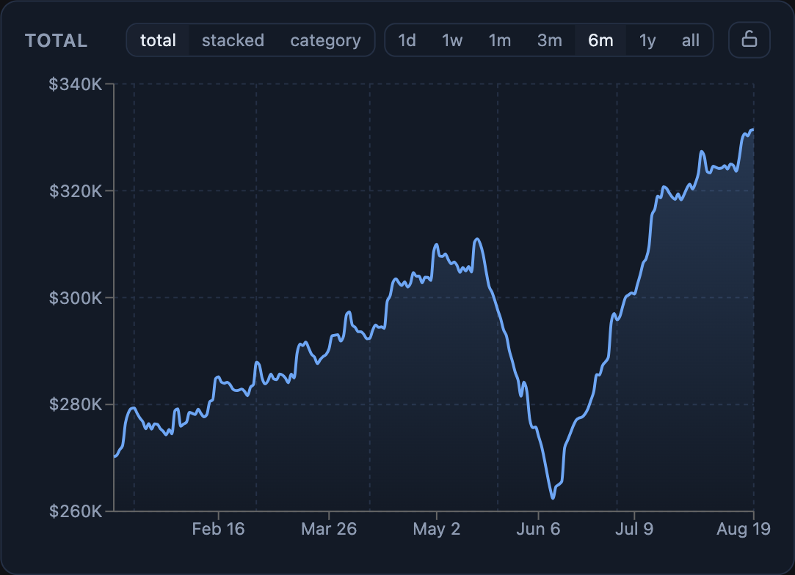
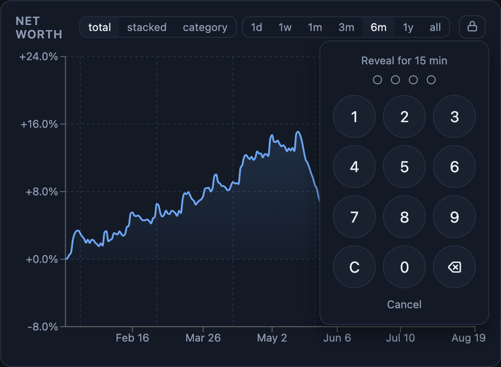
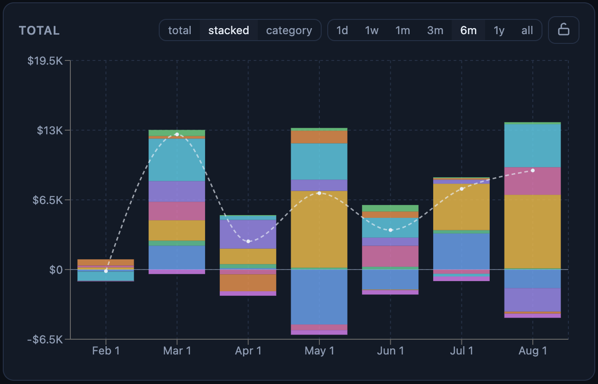
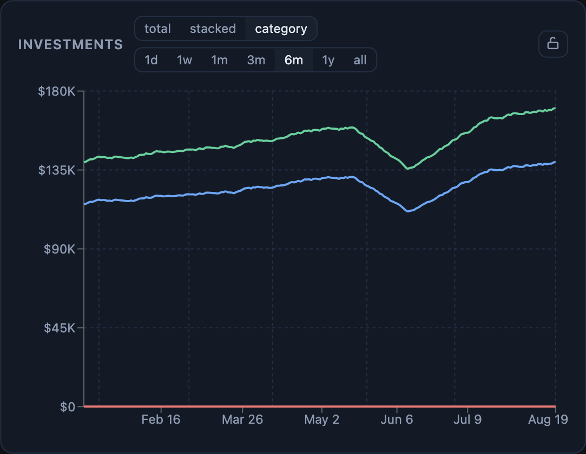
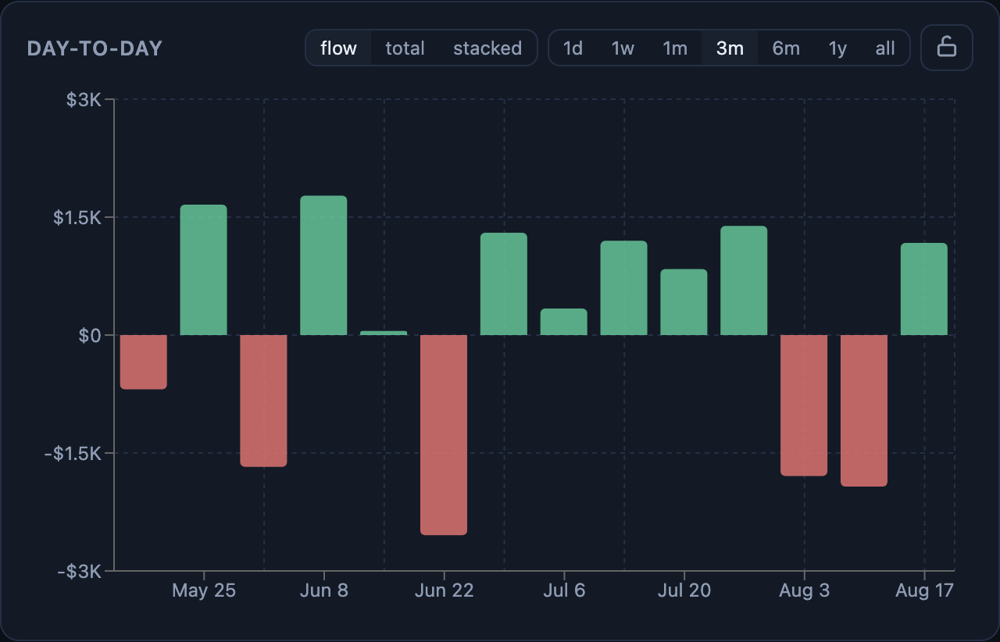
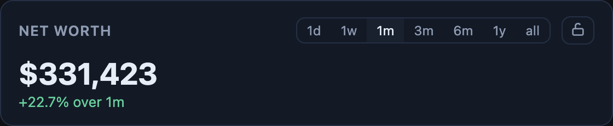
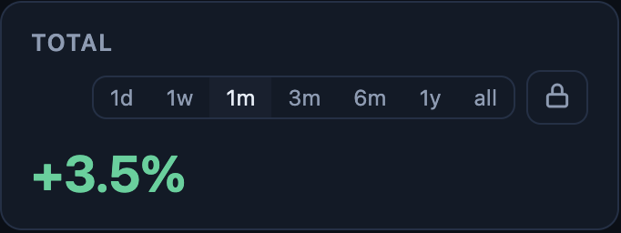
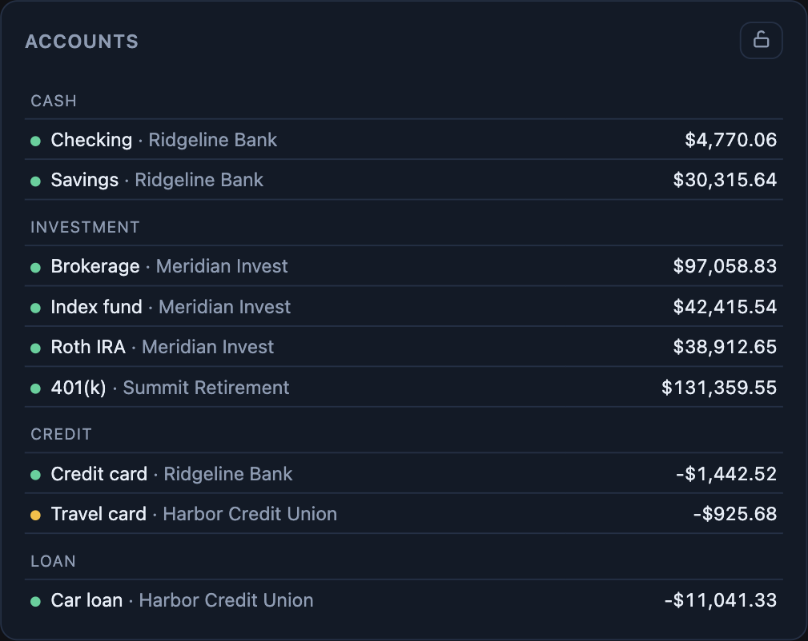

<p align="center">
  <picture>
    <source media="(prefers-color-scheme: dark)" srcset="docs/brand/wordmark-dark.png">
    
  </picture>
</p>

<p align="center">
  Your <a href="https://netwrth.app">netwrth</a> dashboard in Home Assistant —
  the app's own charts, censored by default, revealed by PIN for a window you control.
</p>

<p align="center"></p>

## Install

1. **HACS** → ⋮ → *Custom repositories* → add `https://github.com/eduser25/netwrth-hacs` as **Integration**, install, restart.
2. **netwrth** → *Settings → Integrations → New API key*. Two scopes:
   - `censored only` — can never see real amounts, only percentages. No PIN, nothing to leak. Perfect for wall tablets.
   - `full access` — still starts censored; real amounts appear only after a PIN reveal, and auto-conceal after a timer.
3. **HA** → *Settings → Devices & services → Add integration → netwrth* → paste URL + key.

Cards register themselves. YAML-mode dashboards add the resource manually:

```yaml
lovelace:
  resources:
    - url: /netwrth_static/netwrth-cards.js
      type: module
```

## Privacy

Amounts are redacted **server-side, before they leave your netwrth deployment**, rescaled to percent-of-total — trends survive, dollars don't. The lock on any card opens a PIN pad; the reveal window is key-level, so unlocking one card unlocks every card on every device, and concealing (never needs a PIN) re-locks them all. Chart data flows over websocket, never recorded entities, so revealed amounts stay out of HA's database.

<p align="center"></p>

## Cards

All cards share: `entry` (which netwrth connection), `title`, `theme: netwrth | ha`, `auto_conceal_minutes`. Anything with a header toggle can also be fixed by config — set the value and hide its selector.

### Total over time — `netwrth-worth-card`

The dashboard chart with the web app's views (day-to-day / investments / everything) and modes.

<p align="center"></p>

```yaml
type: custom:netwrth-worth-card
view: all                  # daily | invest | all
mode: total                # total | stacked | category | flow
range: 6m                  # 1d 1w 1m 3m 6m 1y all
compact: true              # $1.2M axis labels instead of $1,200,000
show_mode_selector: false  # pin the mode: hide its toggle
show_range_selector: false # pin the range: hide its toggle
```

**Stacked** breaks the total down by account, debt below the zero line:

<p align="center"></p>

**Category** splits retirement vs taxable vs debt:

<p align="center"></p>

### Net flow — `netwrth-flow-card`

Money kept vs burned per day/week/month over the day-to-day accounts (cash + credit). Balance deltas stand in for income minus spending: green kept, red burned.

<p align="center"></p>

```yaml
type: custom:netwrth-flow-card
range: 3m                  # + the same selector/pinning options as above
```

### Stat — `netwrth-stat-card`

One big number, plus the change over the window in dollars and percent. Censored, the real percent change takes the big slot instead.

<p align="center">
  
  
</p>

```yaml
type: custom:netwrth-stat-card
title: Total
view: all
range: 1m
show_range_selector: false # optional: pin the range
```

### Accounts — `netwrth-accounts-card`

Grouped by kind: balance, change over the selected window, and a sync-freshness dot (green fresh, amber stale). Censored, balances read as share of the total.

<p align="center"></p>

```yaml
type: custom:netwrth-accounts-card
view: all
range: 1m                  # window for the change column
show_range_selector: false # optional: pin the range
accounts:                  # optional: only these (name match, case-insensitive)
  - Savings
  - Roth IRA
```

## Sensors

Censor-safe, always available: total change % (day/week/month/year), per-kind shares %, last balance update, account count, `binary_sensor` censored + data-stale. Real-currency sensors are an explicit opt-in in the integration options — they write real amounts into HA's recorder history while revealed.

```yaml
# alert on a bad week
automation:
  - trigger:
      - platform: numeric_state
        entity_id: sensor.netwrth_total_change_week
        below: -5
    action:
      - action: notify.mobile_app_phone
        data:
          message: "balances down {{ states('sensor.netwrth_total_change_week') }}% this week"
```

## Services

`netwrth.reveal` (fields: `code`, optional `ttl_minutes`, `entry_id`) and `netwrth.conceal`:

```yaml
# re-censor every screen at night
automation:
  - trigger:
      - platform: time
        at: "22:00:00"
    action:
      - action: netwrth.conceal
```

## Options

*Devices & services → netwrth → Configure*: polling interval (15 min), default auto-conceal window (15 min, 0 = stay revealed), real-currency sensor opt-in.

## Development

```sh
cd cards && npm install && npm run build   # emits custom_components/netwrth/frontend/netwrth-cards.js
```

Chart components under `cards/src/{components,lib}` are vendored from the netwrth web app — the rendering is code-identical. Screenshots show demo data.
